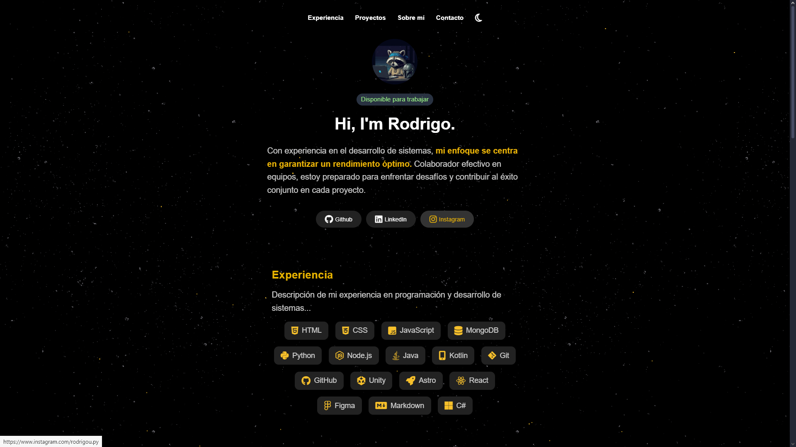

# 🖥️ Personal Portfolio Template

Welcome to this easily customizable personal portfolio template! Built with **HTML**, **JavaScript**, and **CSS**, this template allows you to showcase your work in a sleek and modern way. It includes a **dark/light mode** toggle and a **contact form** powered by **Formspree** for easy communication.

## Key Features

- **Modern Design**: Clean, user-friendly layout to showcase your projects.
- **Responsive Layout**: Fully optimized for desktop and mobile devices.
- **Light & Dark Mode**: Toggle between light and dark themes for better user experience.
- **Project Showcase**: Highlight your projects with links and technologies used.
- **Contact Form (Formspree)**: Easily customizable form to let users contact you directly.
- **Customizable**: Built for easy editing and adaptation to your personal needs.

Explore the demo and other projects on [my GitHub](https://github.com/rodridev-01?tab=repositories).

---

💙 Thank you for checking out this project! Feel free to reach out with any questions.
